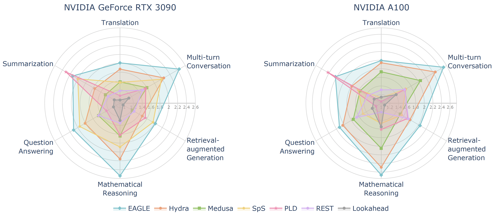

<div align="center">
  <h2><i>Spec-Bench:</i> A Comprehensive Benchmark and Unified<br>Evaluation Platform for Speculative Decoding</h2> 
</div>
<p align="center">
| <a href="https://arxiv.org/abs/2401.07851"><b>Paper</b></a> | <a href="https://sites.google.com/view/spec-bench/"><b>Blog</b></a> | <a href="https://github.com/hemingkx/Spec-Bench/blob/main/Leaderboard.md"><b>Leaderboard</b></a> | <a href="ROADMAP.md"><b>Roadmap</b></a> |
</p>




<div align="center">
<font color="gray">Speedup comparison of Speculative Decoding methods on Spec-Bench, evaluated by Vicuna-7B-v1.3.</font>
</div>

## Introduction

Spec-Bench is a comprehensive benchmark designed for assessing Speculative Decoding methods across diverse scenarios. Based on Spec-Bench, we aim to establish and maintain a unified evaluation platform for open-source Speculative Decoding approaches. This platform facilitates the systematic assessment of existing methods ***in the same device and testing environment***, thereby ensuring fair comparisons. 

Currently, this branch supports the evaluation of the following models with the latest Transformer:

- [EAGLE-1,2,3](https://github.com/SafeAILab/EAGLE)
- [Hydra](https://github.com/zankner/hydra)
- [Medusa](https://sites.google.com/view/medusa-llm)
- [Speculative Sampling](https://huggingface.co/blog/assisted-generation)

## Installation

```
conda create -n specbench python=3.12
conda activate specbench
cd Spec-Bench
pip install -r requirements.txt
```

## Model Weights

Download corresponding model weights (if required) and modify the checkpoint path in `eval.sh`.

- [vicuna-v1.3](https://huggingface.co/lmsys/vicuna-7b-v1.3)
- [EAGLE-1,3](https://github.com/SafeAILab/EAGLE?tab=readme-ov-file#eagle-weights)
- [Hydra](https://github.com/zankner/hydra?tab=readme-ov-file#model-weights)
- [Medusa-1](https://github.com/FasterDecoding/Medusa?tab=readme-ov-file#medusa-1)
- [Speculative Sampling](https://github.com/NJUNLP/MCSD?tab=readme-ov-file#model-release)

## Inference

Select specific command line in `eval.sh`, the results will be stored in `data/spec_bench/model_answer/`.

```
./eval.sh
```

## Speedup Report

Obtain the corresponding speedup compared to vanilla autoregressive decoding.

```
python evaluation/speed.py --file-path /your_own_path/eagle.jsonl --base-path /your_own_path/vicuna.jsonl
```

## Result Comparison

Examine whether the generated results are equal to autoregressive decoding or not.

```
python evaluation/equal.py --file-path /your_own_path/model_answer/ --jsonfile1 vicuna.jsonl --jsonfile2 eagle.jsonl
```

## Contributing

We warmly welcome contributions and discussions related to Spec-Bench! If you have any suggestions for improvements or ideas you'd like to discuss, please don't hesitate to open an issue. This will allow us to collaborate and discuss your ideas in detail.

***More models are welcome!*** - If you're aware of any open-source Speculative Decoding methods not currently included in Spec-Bench, we encourage you to contribute by submitting a pull request. This helps ensure Spec-Bench remains a comprehensive and fair benchmarking platform for comparing existing methods. Please ensure that your changes are well-tested before submission.

## Acknowledgments

This codebase is built from [Medusa](https://github.com/FasterDecoding/Medusa) and [EAGLE](https://github.com/SafeAILab/EAGLE). We integrated code implementations of multiple open-source Speculative Decoding methods to facilitate unified evaluation.

## Citation

If you find the resources in this repository useful, please cite our paper:

```
@inproceedings{xia-etal-2024-unlocking,
    title = "Unlocking Efficiency in Large Language Model Inference: A Comprehensive Survey of Speculative Decoding",
    author = "Xia, Heming and Yang, Zhe and Dong, Qingxiu and Wang, Peiyi and Li, Yongqi  and Ge, Tao and Liu, Tianyu and Li, Wenjie and Sui, Zhifang",
    editor = "Ku, Lun-Wei and Martins, Andre and Srikumar, Vivek",
    booktitle = "Findings of the Association for Computational Linguistics ACL 2024",
    month = aug,
    year = "2024",
    address = "Bangkok, Thailand and virtual meeting",
    publisher = "Association for Computational Linguistics",
    url = "https://aclanthology.org/2024.findings-acl.456",
    doi = "10.18653/v1/2024.findings-acl.456",
    pages = "7655--7671",
}
```

